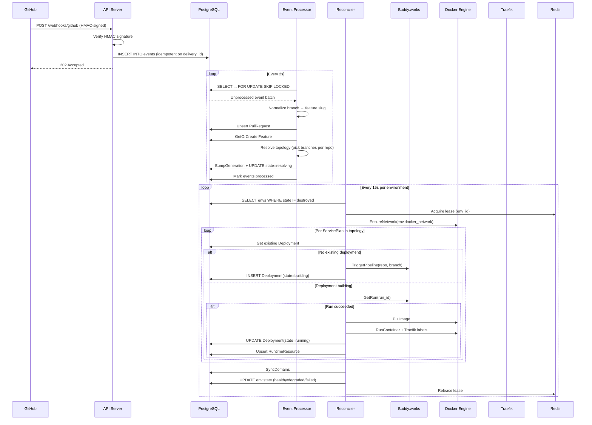
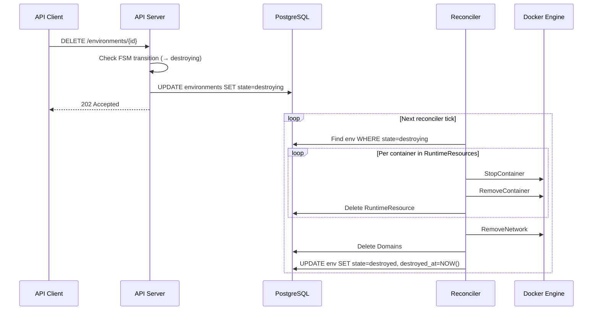
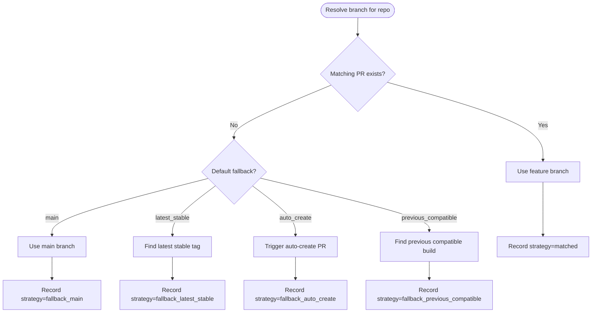

# Data Flow

## GitHub webhook → running environment

## Environment destroy flow

## Branch resolution strategy

When multiple repos share a feature branch, the topology resolver picks the best available image per repo:

