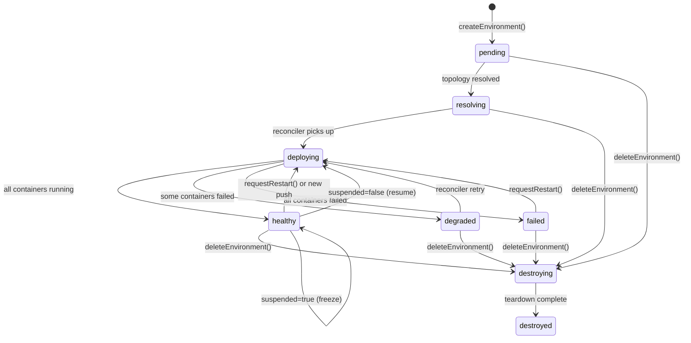

# Environment Lifecycle

## State machine



## Valid transitions

| From | To | Trigger |
|------|----|---------|
| `pending` | `resolving` | Event processor resolves topology |
| `resolving` | `deploying` | Reconciler picks up generation |
| `deploying` | `healthy` | All service plans running |
| `deploying` | `degraded` | ≥1 service failed, ≥1 running |
| `deploying` | `failed` | All services failed |
| `degraded` | `deploying` | Reconciler retry |
| `failed` | `deploying` | `POST /deployments/restart` |
| `healthy` | `deploying` | New push / `POST /deployments/restart` |
| `*` | `destroying` | `DELETE /environments/{id}` |
| `destroying` | `destroyed` | Reconciler teardown complete |

States `destroyed` and `suspended` are terminal/semi-terminal — a destroyed environment is never re-activated. Suspension freezes the reconciler without stopping containers.

## TTL expiry

The TTL Cleaner runs every 60 seconds. It marks environments `destroying` when:

```
last_event_at + ttl_seconds < NOW()
AND state NOT IN ('destroying', 'destroyed')
AND suspended = false
```

Default TTL is 72 hours, configurable per-environment via `ttl` on create.
