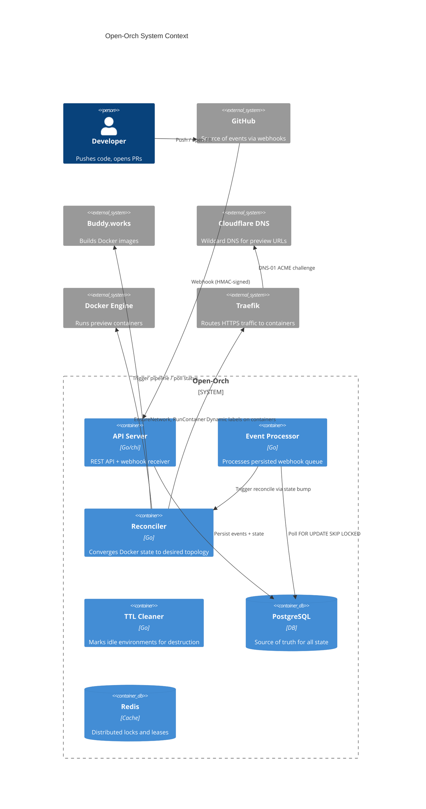
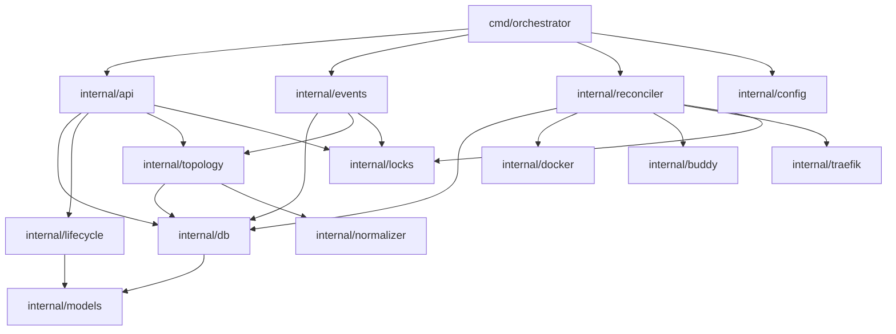

# Architecture Overview

Open-Orch is structured as a single stateless binary backed by PostgreSQL and Redis. It can run multiple instances — the reconciler and event processor coordinate via row-level locks and Redis leases.

## Component diagram

## Internal package structure

## Concurrency model

All long-running goroutines share a single `context.Context` cancelled on `SIGTERM`. They communicate exclusively via PostgreSQL — no in-process channels.

| Goroutine | Interval | Lock |
|-----------|----------|------|
| Event Processor | 2s poll | `FOR UPDATE SKIP LOCKED` on `events` table |
| Reconciler | 15s per env | Redis lease per `environment.id` |
| TTL Cleaner | 60s | No lock needed (idempotent UPDATE) |
| HTTP Server | — | Stateless |
