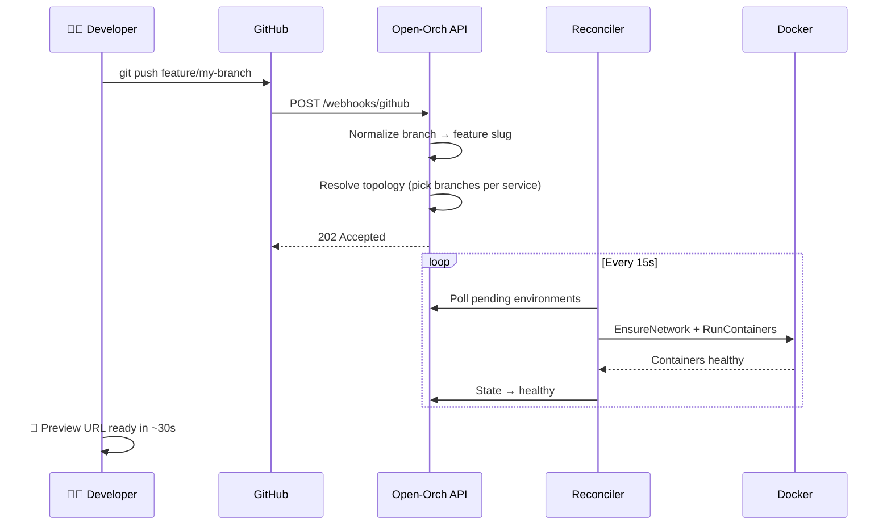

<div style="max-width:900px;margin:0 auto;padding:0 1.5rem;">

## How it works



## Stack at a glance

| Layer | Technology |
|-------|-----------|
| Control plane | Go · chi · zerolog |
| State store | PostgreSQL · pgx |
| Distributed locks | Redis |
| Build executor | Buddy.works |
| Runtime | Docker Engine |
| Ingress + TLS | Traefik v3 · Let's Encrypt |
| Dashboard | React 19 · Vite · Tailwind |
| Docs | VitePress · Mermaid |

## Quick start

```bash
git clone https://github.com/mahdi13830510/open-orch.git
cd open-orch/backend

# Configure
cp deploy/.env.example deploy/.env
# Edit: BASE_DOMAIN, GITHUB_WEBHOOK_SECRET, BUDDY_TOKEN, ORCH_SECRET_KEY

# Launch
docker compose -f deploy/docker-compose.yml up -d --build

# Check
curl https://api.your-domain.com/healthz
# {"status":"ok"}
```

</div>
