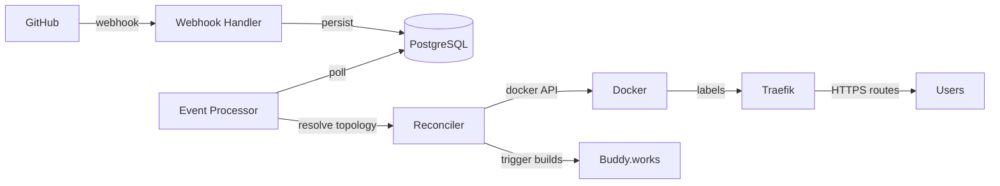

# Introduction

**Open-Orch** is an open-source control plane for ephemeral preview environments. It automatically provisions isolated Docker environments for every feature branch or pull request, routes traffic through Traefik, and tears them down when they're no longer needed.

## How it works



## Key concepts

| Concept | Description |
|---------|-------------|
| **Feature** | A normalized branch slug (`feat/billing` → `feat-billing`) |
| **Environment** | An isolated Docker network + set of containers for one feature |
| **Topology** | The desired state: which repos, which branches, which ports |
| **Deployment** | One service (container) inside one environment |
| **Integration** | Encrypted third-party credentials (GitHub App, Buddy, Cloudflare) |

## Stack

| Layer | Technology |
|-------|-----------|
| API & control plane | Go, chi |
| State store | PostgreSQL |
| Distributed locks | Redis |
| Runtime | Docker |
| Ingress | Traefik v3 |
| Build executor | Buddy.works |
| Dashboard | React 19, Vite, Tailwind |

## Quick start

```bash
# Clone
git clone https://github.com/mahdi13830510/open-orch.git
cd open-orch

# Backend
cd backend
cp deploy/.env.example deploy/.env
# Fill in BASE_DOMAIN, GITHUB_WEBHOOK_SECRET, BUDDY_TOKEN, ORCH_SECRET_KEY
docker compose -f deploy/docker-compose.yml up -d --build

# Frontend (separate terminal)
cd ../frontend
cp .env.example .env
# Set VITE_API_URL=http://localhost:8080
npm install && npm run dev
```

The dashboard will be available at `http://localhost:3000`.
